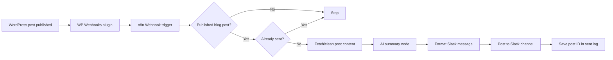

# Part B - Automation sketch

## The goal in one sentence

When a WordPress blog post is published, automatically send a short, useful summary of that post to a team Slack channel.

## Tool I picked + 2-line justification

I would use n8n. It fits this workflow well because it has low-code nodes for webhooks, WordPress/HTTP requests, AI summarization, Slack posting, retries, and execution logs.

It is also easier to control than a simple Zapier zap: an agency can self-host it later, inspect failed runs, and add approval or logging steps without rebuilding the workflow.

## Local prototype

I also built a local n8n demo of this workflow on my laptop. The demo receives a WordPress-like webhook payload, checks that the post is published, creates a mock AI summary, formats a Slack message, posts it to Slack with an Incoming Webhook, and returns the result through the webhook. Screenshots: `04-ai-automations/submission/n8n-slack-workflow-screenshot.png` and `04-ai-automations/submission/slack-message-result-screenshot.png`.

## Trigger

The trigger is a WordPress webhook fired when a post status changes to `publish`. I would use the WP Webhooks plugin to send a POST request to an n8n Webhook URL, including the post ID, title, URL, author, excerpt, content, and publish date.

## Steps

1. WordPress publishes a new blog post and sends the post data to the n8n webhook.
2. n8n checks that `post_type` is `post` and `post_status` is `publish`, so drafts, pages, and updates are ignored.
3. n8n checks a small sent-log table by post ID to avoid posting the same article twice.
4. If the webhook payload is missing full content, n8n fetches the post from the WordPress REST API using `/wp-json/wp/v2/posts/{id}`.
5. The workflow removes HTML tags, shortcodes, menus, and extra whitespace, then trims the article text to a safe length for the AI step.
6. The AI node writes a Slack-ready summary: 2 short sentences, 3 bullet takeaways, and no invented facts.
7. A formatting step builds the Slack message with the post title, author, summary, bullet points, and the live URL.
8. The Slack node posts the message to a channel such as `#content-updates`.
9. After Slack confirms success, n8n stores the post ID, URL, timestamp, and Slack message ID in the sent-log table.

## 2 failure modes I would handle

1. **Failure:** WordPress fires the webhook more than once for the same post.  
   **Handling:** Check the sent-log table before posting. If the post ID already exists, stop the run instead of sending a duplicate Slack message.

2. **Failure:** The AI or Slack API fails because of rate limits, network issues, or an invalid token.  
   **Handling:** Retry the failed step up to 3 times with a short delay. If it still fails, send an alert to the site admin and keep the post marked as unsent so it can be retried manually.

## Diagram

## Part C - A repetitive task I would automate

The task is preparing weekly client SEO status emails from Search Console, Ahrefs, and task updates.
It is repetitive because account managers often do it every Friday for multiple clients using the same structure.
I would use n8n with Google Sheets, Search Console, Ahrefs exports, and Gmail draft creation.
The trigger would run every Friday morning, collect the key metrics, compare them with last week, and draft a client email with wins, issues, and next actions.
The biggest failure mode is sending the wrong numbers to the wrong client, so I would create drafts only and require human review before sending.
